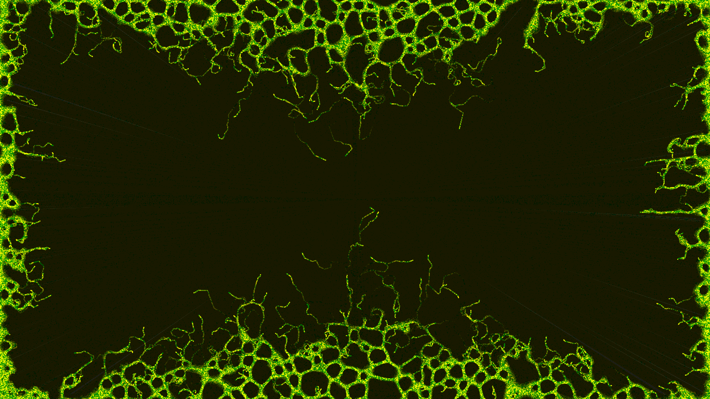
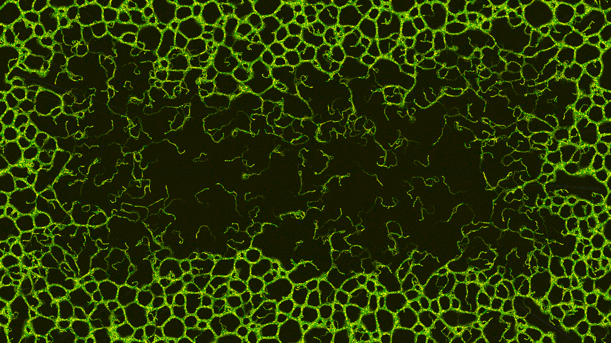
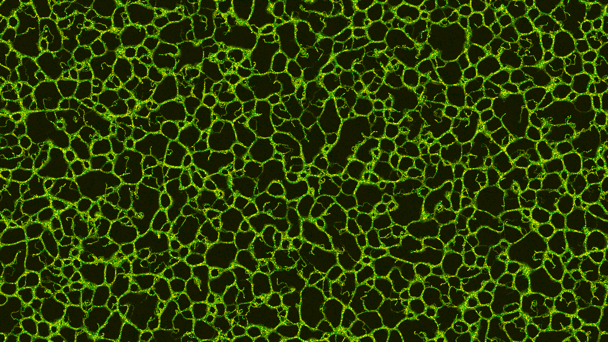
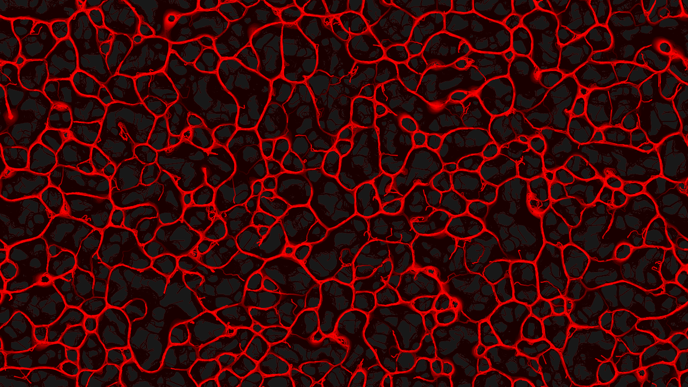
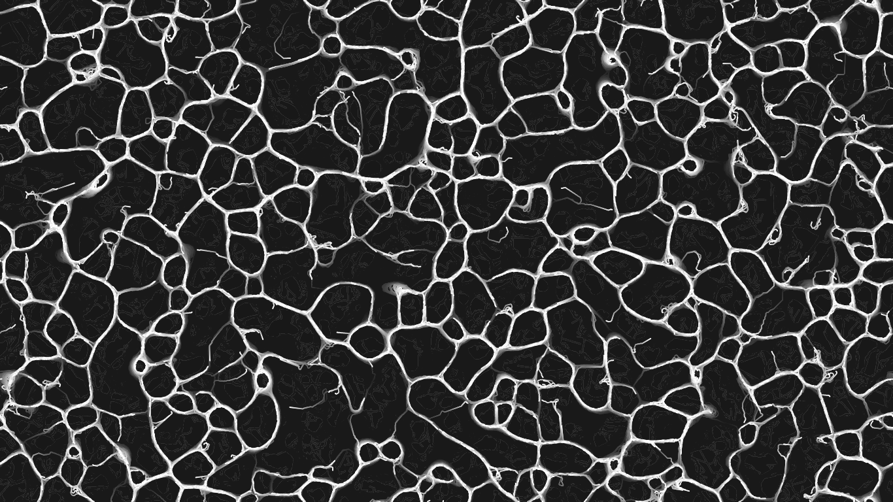
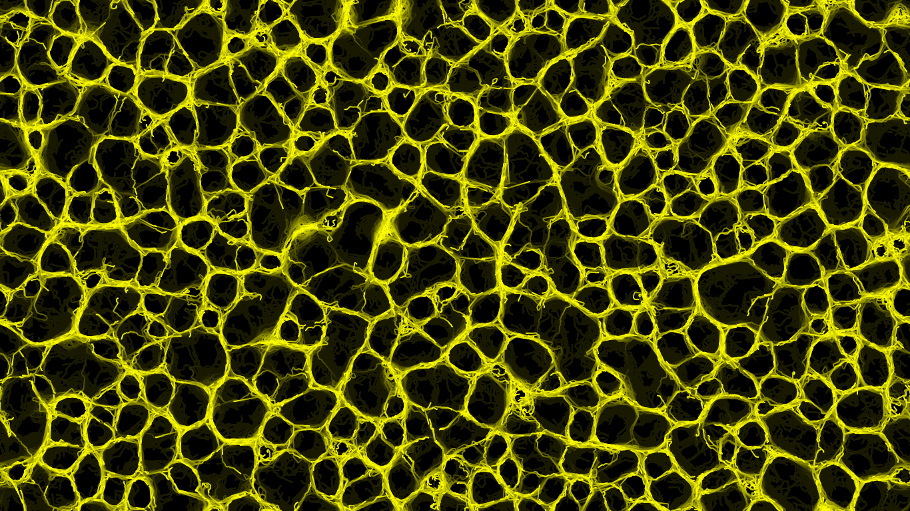
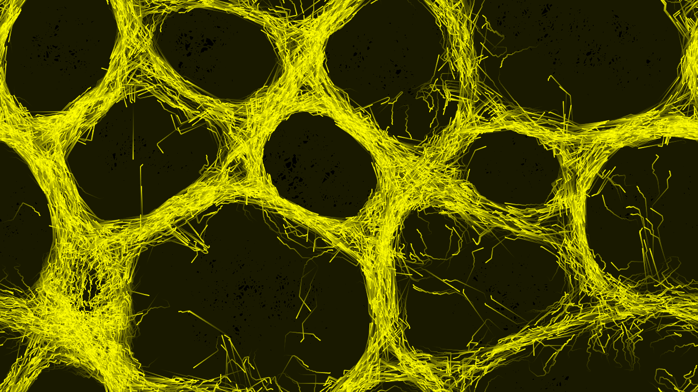

# Slime Mold Simulation in p5.js
This project implements a simulation of the slime mold behavior using p5.js, inspired by the movement and pattern formation of real slime molds. The slime molds are represented as particles that leave visual traces on a canvas as they explore their environment, searching for optimal paths and forming organic patterns.

## Features:
Particle-based slime mold simulation: Simulates individual "agents" (particles) that move based on simple rules, mimicking slime mold behavior.
Dynamic trail rendering: The particles leave a fading trail, creating a visual effect of organic growth.
Background fading: Implements controlled background dimming to ensure smooth trail visibility without permanent traces.
Adjustable parameters: Allows customization of particle speed, direction randomness, and trail intensity for different simulation behaviors.
Interactive interface: Save a GIF file by pressing 'g' on your keyboard (5 seconds GIF).

## Technologies:
p5.js: A JavaScript library for creative coding, primarily used for rendering the visual simulation and handling particle behavior.
JavaScript: Core logic for agent movement and simulation updates.

## Results:

### Evolution of a slime mold:

### Different colors:

### Different sizes:

### Process of slime molds:

## Future Improvements:
Add multiple slime mold colonies.
Implement environmental obstacles for more complex pattern formation.
Optimize performance for larger simulations.
